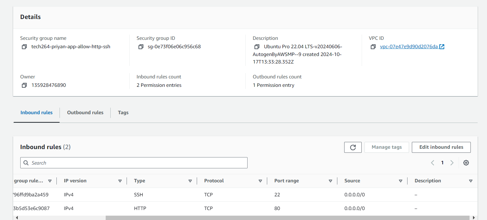
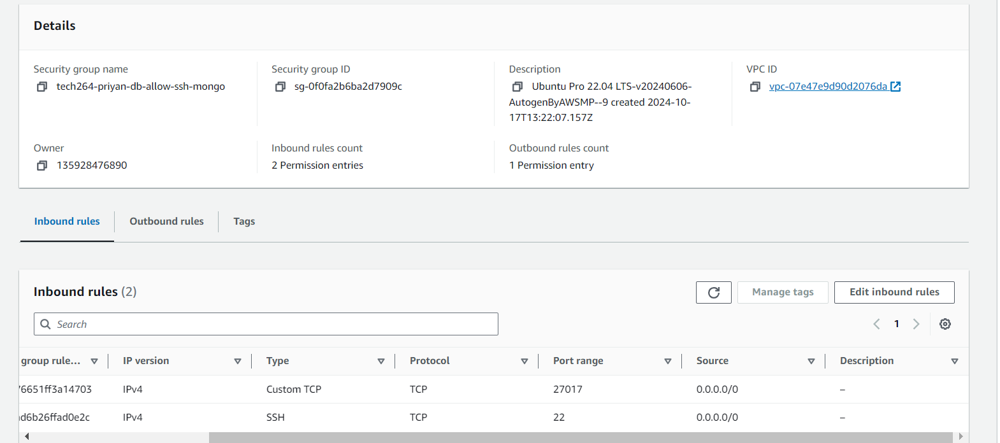

# Deploying App in 2-tier architecture on AWS
 
1. In the search bar, type `EC2` and select it.
2. Navigate to instances, then select **launch instances** on the right.
3. Input an appropriate name.
4. Make sure you create the DB EC2 instance. 
 
### --> app and OS image
1. Select **Ubuntu Server Pro 22.04 LTS (HVM), SSD Volume Type**.
 
### --> Instance Type
1. Make sure to select **t2.micro** for the instance type.
 
### --> Key Pair Login
1. Create a new key pair.
2. Input the correct name.
3. Select create and you will download your `.pem` key. This is the equivalent of a **private key** on **Azure**.
4. Make sure when you create a key pair and it has downloaded, you should move this to your `.ssh` directory. 
### --> If previously created...
1. Use an existing key.
 
### --> Network Settings
1. Select **create security group**. *Remember, you need a **UNIQUE** security group for each VM.* (you can use these security groups more frequently).
2. Allow **SSH** traffic and **Custom TCP** for the **Database** EC2, allow **SSH** & **HTTP** for **App** EC2.
3. With all of these rules we use the `0.0.0.0/24`

### --> Add Inbound Port Rules
1. Navigate to **Security Groups** under **Network and Security**.
2. Search for the NSG you wish to modify.

 
### --> Advanced details
1. Locate user data and input the relative data for the **EC2**.
2. Make sure you use the private IP of the DB VM created first in the user data for the app.

### --> Review
1. Review your details then launch instances.

### Potential Blockers 
1. Network settings and the inbound rules
2. Making the subnets which is not necessary for this specific task. 
3. Making keys locally when you can do it on AWS. 
4. Private IP from the database within the environment variable should be added. 