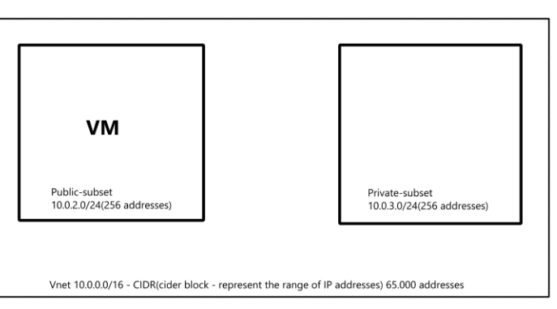

# VM, VNet and Azure

- [VM, VNet and Azure](#vm-vnet-and-azure)
  - [Diagram of VM:](#diagram-of-vm)
  - [Steps to Create a Virtual Network and a New SSH Key Pair in Azure](#steps-to-create-a-virtual-network-and-a-new-ssh-key-pair-in-azure)
  - [1. Creating a Virtual Network (VNet) in Azure](#1-creating-a-virtual-network-vnet-in-azure)
    - [What is a Virtual Network (VNet)?](#what-is-a-virtual-network-vnet)
    - [Steps to Create a Virtual Network](#steps-to-create-a-virtual-network)
    - [More condensed steps:](#more-condensed-steps)
    - [Details needed to plan/create a VNet](#details-needed-to-plancreate-a-vnet)
  - [How to create a VNet?](#how-to-create-a-vnet)
  - [Diagram for planning:](#diagram-for-planning)
  - [Creating a New SSH Key Pair for Azure Virtual Machines](#creating-a-new-ssh-key-pair-for-azure-virtual-machines)
    - [What is an SSH Key Pair?](#what-is-an-ssh-key-pair)
    - [Steps to Create an SSH Key Pair (Using Linux/macOS or Windows PowerShell):](#steps-to-create-an-ssh-key-pair-using-linuxmacos-or-windows-powershell)


## Diagram of VM:

```plaintext
Resource Group
    |
    v
+-------------------+
|      Region       |
+-------------------+
    |
    v
+-------------------+
|       VNet        |
+-------------------+
    |
    v
+-------------------+
|      Subnet       |
+-------------------+
    |
    v
+----------------------------+
| Network Interface (NIC)     |
+----------------------------+
    |
    +---------------------------------------------+
    |                                             |
    v                                             v
+------------------+                     +-------------------+
|     Public IP    |                     |        Disk       |
+------------------+                     +-------------------+
    |
    v
+---------------------------+
|   Network Security Group   |
|           (NSG)            |
+---------------------------+
    |
    +-----------------------+------------------------+
    |                       |                        |
    v                       v                        v
+-----------------+   +-------------------+   +-------------------+
| Allow SSH Rule  |   |  Allow HTTP Rule  |   |     SSH Key        |
| (port 22)       |   |   (port 80)       |   +-------------------+
+-----------------+   +-------------------+
    |
    v
+--------------------------+
|      Virtual Machine      |
+--------------------------+
```

## Steps to Create a Virtual Network and a New SSH Key Pair in Azure

## 1. Creating a Virtual Network (VNet) in Azure

### What is a Virtual Network (VNet)?
A Virtual Network (VNet) in Azure allows resources like virtual machines (VMs), databases, and applications to securely communicate with each other, the internet, and other networks. 

### Steps to Create a Virtual Network

1. **Log in to Azure Portal:**   - Go to the [
Azure Portal
](
https://portal.azure.com
).   - Sign in with your Azure account credentials. 
2. **Create a New Resource Group:**   - Navigate to "Resource Groups" from the left-hand menu.   - Click on `+ Create`.   - Fill in the necessary details (like subscription, resource group name, and region).   - Click `Review + Create`, then `Create`. 
3. **Create the Virtual Network:**   - Go to "Virtual Networks" in the Azure Portal.   - Click create
at the top of the page.    
4. **Configure Basic Settings:**   - **Subscription**: Choose the correct subscription.   - **Resource Group**: Select the resource group you created earlier.   - **Name**: Enter a name for your virtual network.   - **Region**: Select the region where you want to create the VNet. 
5. **Configure IP Addresses:**   - Go to the "IP Addresses" tab.   - Define the **Address Space** (default is a /16 CIDR block, e.g., `10.0.0.0/16`).   - Under **Subnets**, click `+ Add subnet` to create subnets for the VNet (e.g., a default subnet `10.0.1.0/24`). 
6. **Configure Security:**   - Go to the "Security" tab to enable any specific security features such as **DDOS Protection** or **Firewall** (optional, based on your needs). 
7. **Review and Create:**   - Click `Review + Create` to validate the configuration.   - If validation passes, click `Create`. 
8. **Deployment:**   - Wait for the VNet deployment to finish. Once deployed, you can manage the VNet through the Azure Portal.

### More condensed steps: 

**VNet(virtual Network)** -  allows to securely communicate between Azure resources, such as VMs(virtual machines), web apps and databases. 
 
 
### Details needed to plan/create a VNet
 
1. **Address Space(CIDR Block)*
- Decide the IP address range the VNet will cover (e.g. 10.0.0.0/16)
 
 
2. **Subnets:** 
- Divide the VNet into subnets            
- Each subnet should have its own IP address range
  - **public_subnet**t(10.0.2.0/24(256 addresses))
  - **private_subnet**t(10.0.3.0/24(256 addresses))
 
 
3. **Regions:** 
- Choose the Azure region where the Vnet will be created (e.g Europe Uk south)
 
## How to create a VNet?
1. Search for VNet
2. Click + create button
3. Set the name of subscription and resource group
4. Set the virtual networking name (e.g tech264-..)
5. Region : (Europe)Uk South
6. Check Security
7. IP addresses
- Add subsets and set their IP address range(only IPv4):
  - Name
  - Starting address
  - Size
8. Tags :
   - Name : Owner
   - Value : My name
 
9. Review + create  
10. Click create

## Diagram for planning: 



##  Creating a New SSH Key Pair for Azure Virtual Machines

### What is an SSH Key Pair? 
An SSH key pair consists of a public and private key used to authenticate access to virtual machines securely. 

### Steps to Create an SSH Key Pair (Using Linux/macOS or Windows PowerShell):
1. **Open a Terminal or PowerShell:**   - On Linux/macOS, open the terminal.   - On Windows, use PowerShell or the Windows Subsystem for Linux (WSL). 
2. **Generate SSH Key Pair:**   Use the following command to generate an SSH key pair:    
```bash 
ssh-keygen -t rsa -b 4096 -C "your_email@example.com"
```

   
