# Cloud Computing and Linux
- [Cloud Computing and Linux](#cloud-computing-and-linux)
  - [1. How do we know if something is in the cloud?](#1-how-do-we-know-if-something-is-in-the-cloud)
  - [2. Differences between On-Prem and the Cloud?](#2-differences-between-on-prem-and-the-cloud)
  - [3. The 4 Deployment Models of Cloud:](#3-the-4-deployment-models-of-cloud)
  - [4. Types of Cloud Services:](#4-types-of-cloud-services)
  - [5. Advantages/Disadvantages of the Cloud for Businesses:](#5-advantagesdisadvantages-of-the-cloud-for-businesses)
    - [Advantages:](#advantages)
    - [Disadvantages:](#disadvantages)
  - [6. Difference Between OpEx vs CapEx:](#6-difference-between-opex-vs-capex)
  - [7. Is migrating to the cloud always cheaper?](#7-is-migrating-to-the-cloud-always-cheaper)
  - [8. Market Share - Cloud:](#8-market-share---cloud)
  - [9. What are the 3 largest Cloud providers known for?](#9-what-are-the-3-largest-cloud-providers-known-for)
  - [10. Which cloud provider might be the best? Why?](#10-which-cloud-provider-might-be-the-best-why)
  - [11. What do you usually pay for in the cloud?](#11-what-do-you-usually-pay-for-in-the-cloud)
  - [12. What are the 4 Pillars of DevOps, and how do they link into the Cloud?](#12-what-are-the-4-pillars-of-devops-and-how-do-they-link-into-the-cloud)
- [Linux](#linux)
  - [**Commands:**](#commands)
  - [What is Linux?](#what-is-linux)
  - [Task 1: Linux - Research managing file ownership with Linux](#task-1-linux---research-managing-file-ownership-with-linux)
  - [Task 2: Research Managing File Permissions](#task-2-research-managing-file-permissions)
  - [Task 3: Numeric Values Assigned to File Permissions](#task-3-numeric-values-assigned-to-file-permissions)
    - [What numeric values are assigned to each permission?](#what-numeric-values-are-assigned-to-each-permission)
    - [What value would assign read + write permissions?](#what-value-would-assign-read--write-permissions)
    - [What value would assign read, write, and execute permissions?](#what-value-would-assign-read-write-and-execute-permissions)
    - [What value would assign read and execute permissions?](#what-value-would-assign-read-and-execute-permissions)
    - [What do you think 644 would mean?](#what-do-you-think-644-would-mean)
    - [Summary of Numeric Permissions](#summary-of-numeric-permissions)
  - [Task 4: Research changing file permissions](#task-4-research-changing-file-permissions)
- [Making a bash script](#making-a-bash-script)
  - [How to make ta script and run it](#how-to-make-ta-script-and-run-it)
  - [Environment Variables](#environment-variables)
    - [Setting up an Environment variables](#setting-up-an-environment-variables)
- [Deleting Your Virtual Machine](#deleting-your-virtual-machine)
- [Virtual machine - Deploy Sparta App](#virtual-machine---deploy-sparta-app)
  - [How to get a folder into your VM](#how-to-get-a-folder-into-your-vm)
  - [Install MongoDB on Ubuntu 22.04](#install-mongodb-on-ubuntu-2204)
- [Making a Database in Azure - MongoDB](#making-a-database-in-azure---mongodb)
  - [Task: Get the 'app' folder onto the Azure VM using "git"](#task-get-the-app-folder-onto-the-azure-vm-using-git)
  - [Nginx Reverse Proxy Setup](#nginx-reverse-proxy-setup)
    - [1. Install Nginx](#1-install-nginx)
    - [For Ubuntu/Debian:](#for-ubuntudebian)
    - [2. Configure Nginx as a Reverse Proxy](#2-configure-nginx-as-a-reverse-proxy)
    - [Open the Nginx configuration file:](#open-the-nginx-configuration-file)
    - [Add Reverse Proxy Configuration:](#add-reverse-proxy-configuration)
    - [Save and exit the file.](#save-and-exit-the-file)
    - [3. Test the Nginx Configuration](#3-test-the-nginx-configuration)
    - [5. Restart Nginx](#5-restart-nginx)
    - [6. Check](#6-check)
  - [Task: How many services can use a port?](#task-how-many-services-can-use-a-port)
    - [Objective](#objective)
    - [Step 1: Run the Sparta App](#step-1-run-the-sparta-app)
    - [Step 2: Open a Second Terminal and Run the App](#step-2-open-a-second-terminal-and-run-the-app)
      - [Expected Error](#expected-error)
    - [Explanation of the Error](#explanation-of-the-error)
    - [Step 3: Fixing the Error](#step-3-fixing-the-error)
    - [Option 1: Change the Port Number](#option-1-change-the-port-number)
    - [Option 2: Kill the Existing Process Using Port 3000](#option-2-kill-the-existing-process-using-port-3000)
    - [Step 4: Finding the Process Using Port 3000](#step-4-finding-the-process-using-port-3000)
    - [Linux Command:](#linux-command)
    - [Example Output](#example-output)
    - [Step 5: Killing the Process](#step-5-killing-the-process)
  - [Task: Run Sparta app in the background](#task-run-sparta-app-in-the-background)
  - [Work out ways to both run, stop and re-start the app in the background (besides using the "\&" at the end of the command):](#work-out-ways-to-both-run-stop-and-re-start-the-app-in-the-background-besides-using-the--at-the-end-of-the-command)
    - [One way should use pm2](#one-way-should-use-pm2)
  - [Final app and db scripts:](#final-app-and-db-scripts)
    - [Testing process](#testing-process)
  - [Images - plan for creating using an app + db image:](#images---plan-for-creating-using-an-app--db-image)
  - [**To create image:**](#to-create-image)
    - [Possible blockers](#possible-blockers)
  - [Alerting and Monitoring](#alerting-and-monitoring)
    - [1. Manual Monitoring (Worst)](#1-manual-monitoring-worst)
    - [2. Basic Autoscale with Default Thresholds](#2-basic-autoscale-with-default-thresholds)
    - [3. Monitoring with Alerts](#3-monitoring-with-alerts)
    - [4. Custom Autoscaling with Advanced Rules](#4-custom-autoscaling-with-advanced-rules)
    - [5. Continuous Load Testing + Auto-healing with Health Probes (Best)](#5-continuous-load-testing--auto-healing-with-health-probes-best)
  - [Types of Scaling](#types-of-scaling)
  - [Architecture for an Azure VM Scale Set Internet](#architecture-for-an-azure-vm-scale-set-internet)
    - [How to increase CPU](#how-to-increase-cpu)
    - [Dashboard VM](#dashboard-vm)
    - [Load testing with Apache Bench and how to create unhealthy instances](#load-testing-with-apache-bench-and-how-to-create-unhealthy-instances)
  - [Scale sets on Azure](#scale-sets-on-azure)
    - [Basics --\>](#basics---)
    - [Disks --\>](#disks---)
    - [Networking --\>](#networking---)
    - [Health --\>](#health---)
    - [Advanced --\>](#advanced---)
    - [Tags --\>](#tags---)
    - [Review and Create --\>](#review-and-create---)
    - [Delete --\>](#delete---)
    - [To SSH:](#to-ssh)
  - [What is a load balancer?](#what-is-a-load-balancer)
    - [Managing Instances in a Scale Set](#managing-instances-in-a-scale-set)
    - [Create an Unhealthy Instance for Testing](#create-an-unhealthy-instance-for-testing)
    - [Steps to Simulate an Unhealthy Instance:](#steps-to-simulate-an-unhealthy-instance)
  - [Setting Up a Dashboard in Azure](#setting-up-a-dashboard-in-azure)
    - [Steps to Setup a Dashboard:](#steps-to-setup-a-dashboard)
  - [How Load Testing and Dashboard Helped Us](#how-load-testing-and-dashboard-helped-us)
  - [CPU Usage Alert Setup](#cpu-usage-alert-setup)
    - [Steps to Setup CPU Usage Alert:](#steps-to-setup-cpu-usage-alert)
  - [Remove dashboards and alert and action group](#remove-dashboards-and-alert-and-action-group)
    - [Removing a Dashboard](#removing-a-dashboard)
    - [Removing an Alert Rule](#removing-an-alert-rule)
    - [Removing an Action Group](#removing-an-action-group)
- [Re-create the 3-subnet architecture to make the database private](#re-create-the-3-subnet-architecture-to-make-the-database-private)
  - [Set up the Virtual Network](#set-up-the-virtual-network)
    - [--\> Basics](#---basics)
    - [--\> IP addresses](#---ip-addresses)
    - [--\> Tags](#---tags)
    - [--\> Review and Create](#---review-and-create)
  - [Create Database VM](#create-database-vm)
    - [--\> Basics](#---basics-1)
    - [--\> Review and Create](#---review-and-create-1)
  - [Create the App VM](#create-the-app-vm)
    - [--\> Basics](#---basics-2)
    - [--\> Networking](#---networking)
    - [--\> Advanced](#---advanced)
    - [--\> Review and Create](#---review-and-create-2)
  - [Create a virtual machine for the NVA.](#create-a-virtual-machine-for-the-nva)
    - [--\> Basics](#---basics-3)
    - [--\> Networking](#---networking-1)
    - [--\> Review and Create](#---review-and-create-3)
    - [Steps for Code-along (3 subnet architecture)](#steps-for-code-along-3-subnet-architecture)
  - [How to make a Database private using a 3 Subnet Architecture](#how-to-make-a-database-private-using-a-3-subnet-architecture)
    - [Stopping all the VMs and Restarting](#stopping-all-the-vms-and-restarting)

## 1. How do we know if something is in the cloud? 
Cloud services are typically accessed over the internet, meaning the data or application isn't hosted locally. If you're accessing resources or apps without needing specific local hardware, it's likely cloud-based.

## 2. Differences between On-Prem and the Cloud?
- **On-Prem**: Resources are hosted and managed on the company's own servers.
- **Cloud**: Resources are hosted on external servers, managed by cloud providers, and accessed via the internet.

| On-Prem | Cloud |
| ------- | ----- |
| Requires internal management of hardware and software. | Managed by the cloud provider. |
| High upfront costs. | Lower initial costs, often subscription-based. |
| Physical proximity to resources. | Accessible from anywhere with internet access. |

## 3. The 4 Deployment Models of Cloud: 
- **Private Cloud**: Dedicated to a single organization, offering enhanced control and security. Can be run without internet (on a cruise ship). 
- **Public Cloud**: Services provided over the internet and shared across multiple users.
- **Hybrid Cloud**: A mix of private and public clouds, offering flexibility. This allows businesses to maintain private data on-prem while leveraging cloud for scalability. Some data needs to stay on-prem because of compliance reasons (private user data). 
- **Multi-Cloud**: Use of multiple cloud services from different providers. May use this because of redundancy (having backups - this is common in the finance sector). 

| Deployment Model | Description |
| ---------------- | ----------- |
| Private Cloud | More secure, but expensive and complex. |
| Public Cloud | Cost-effective but less control over security. |
| Hybrid Cloud | Combines the best of both worlds. |
| Multi-Cloud | Increased redundancy and flexibility. |

## 4. Types of Cloud Services:
- **IaaS (Infrastructure as a Service)**: Provides virtualized computing resources over the internet.
- **PaaS (Platform as a Service)**: Offers hardware and software tools over the internet, typically for app development.
- **SaaS (Software as a Service)**: Delivers software applications via the internet, accessible through a browser. **Data is managed by you.**
  

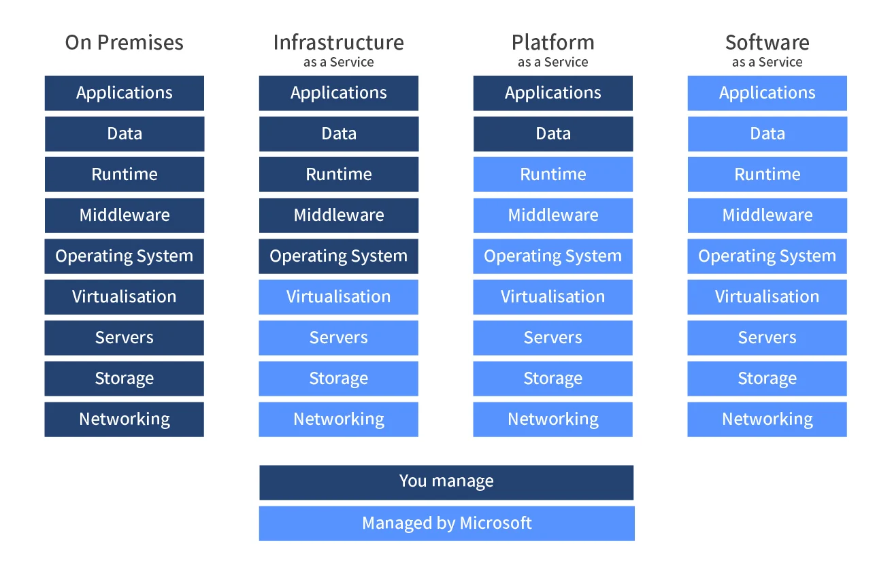

| Service Type | Example | Description |
| ------------ | ------- | ----------- |
| IaaS | AWS EC2 | Provides virtual machines and storage. |
| PaaS | Google App Engine | Platform to develop and deploy apps. |
| SaaS | Dropbox | Ready-to-use applications accessible online. |

## 5. Advantages/Disadvantages of the Cloud for Businesses:

### Advantages:
- Scalability
- Could be cost-effective
- Access to advanced technologies
- Less maintenance of hardware
- Disaster recovery
- Automatic updates 
- Guaranteed level of service

### Disadvantages:
- Security risk becaues you do not have physical control of the security
- Limited control
- Ongoing costs
- Downtime (can go either way)

## 6. Difference Between OpEx vs CapEx:
- **OpEx (Operational Expenditure)**: Ongoing costs for running services (e.g., cloud subscription).
- **CapEx (Capital Expenditure)**: Upfront investment in physical infrastructure (e.g., data centers).
- **Cloud**: Shifts costs from CapEx to OpEx, making costs more predictable but continuous.

## 7. Is migrating to the cloud always cheaper?
* While the cloud offers lower upfront costs, long-term costs can be higher due to recurring subscription fees, especially for large-scale operations.
* For cloud services there are cost optimisation tools that can keep costs down. AWS has Trusted Advisor and other tools to help with this. 
* AWS has a pay as you go model. 


## 8. Market Share - Cloud:

**Cloud Market:**
1. AWS
2. Microsoft Azure
3. Google Cloud Platform

Market share breakdown:
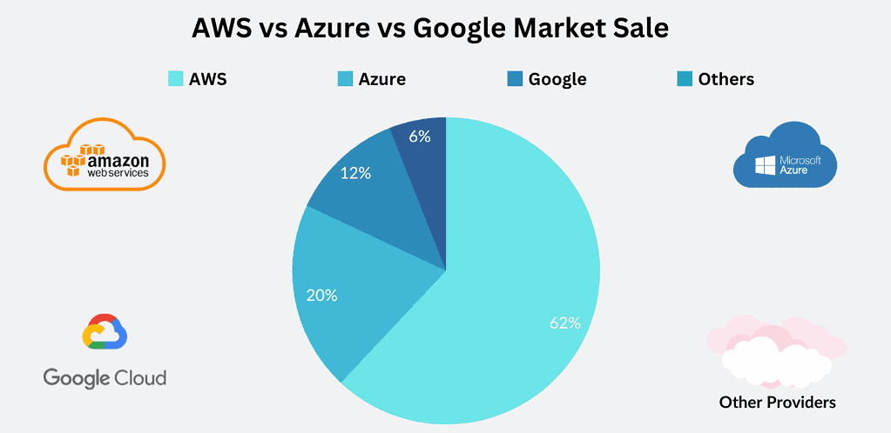


## 9. What are the 3 largest Cloud providers known for?

- **AWS**: Known for its extensive service offerings and scalability.
- **Microsoft Azure**: Strong in hybrid cloud solutions and integrations with enterprise tools.
- **Google Cloud Platform**: Popular for AI and data analytics.

## 10. Which cloud provider might be the best? Why?
The best cloud provider depends on your needs:
- **AWS** for versatility and global reach.
- **Azure** for seamless enterprise integrations.
- **Google Cloud** for cutting-edge AI/ML services.

## 11. What do you usually pay for in the cloud?
- Storage
- Compute power
- Data transfer (Egress - transfer out)
- Additional services like security, databases, and networking

## 12. What are the 4 Pillars of DevOps, and how do they link into the Cloud?
1. **Collaboration**: Cloud enables team collaboration through shared resources.
2. **Automation**: Cloud platforms allow for automated scaling and deployment.
3. **Continuous Integration/Delivery**: Cloud environments facilitate seamless CI/CD pipelines.
4. **Monitoring and Feedback**: Cloud providers offer integrated monitoring tools for proactive issue detection.


# Linux
## **Commands:** 
* `pwd`: Print working directory
* `cd`: Change directory 
* `ls`: List files and directories
* `mkdir`: Create/make new directory
* `rmdir`: Remove an empty directory 
* `rm`: Remove files or directories 
* `cp`: Copy files or directories 
* `mv`: Move or rename files or directories
* `touch`: Create a new, empty file 
* `cat`: View contents of a file
* `exit`: To exit 
* `uname`: Name of OS
* `whoami`: The admin
* `history`: Shows a history of commands used
* `curl`: Fetches web content, downloading files, sending data to servers etc.
* `wget`: Downloading files
* `file`: Outputs the file type
* `nano`: Edits file. 
* `head`: Shows the top of the file and you can specify how many lines
* `tail`: Shows the bottowm of the file and you can specify how many lines
* `nl`: Displays the number of each line in a file
* `sudo`: Superuser do - which is to perform administative tasks
* `apt`: It simplifies the process of installing, updating, and removing software packages
* `su`: Superuser - to become the root user

## What is Linux?
* Clone of Unix (OS before Linux)
* Can be run on any computer
  
## Task 1: Linux - Research managing file ownership with Linux
* **Managing file ownership** is important because of system security and proper functioning in a multi-user environment. 
* Ownership is important as it determines who can access, modify, or execute files, ensuring that sensitive files are only accessible by authorized users. 
* Proper ownership management prevents accidental or malicious actions from unauthorized users and allows system administrators to maintain control over system resources.
* Command to view file ownership is:
`ls -l`. 
* File and directories have default permissions when they are created.
  * **Files**: Read and write for owner and group. Read-only for others. 
  * **Groups**: Read, write and execute for owners and groups. Read and write for others.  
* The created file belongs to 
  1. The user who created it  
  2. The group associated with that user. 
* The owner does not receive execute (X) permissions when creating files because, for security reasons, executable permissions are not typically granted automatically for newly created files. This prevents potentially harmful scripts or binaries from being executed unintentionally.
* Command to change the owner of a file/directory is: `chown`

## Task 2: Research Managing File Permissions
* **Being the owner of the file does not give you full permissions (read, write and execute)**. The owner can have any combination of these permissions, which means they might not have full permissions (read, write, execute) if those permissions were not set appropriately. For example, an owner could have only read and write permissions but not execute permission.
  
* Giving permissions to the **User** entity means that those permissions apply specifically to the owner of the file. The User entity is the individual who created the file (or the one who has been assigned ownership). Permissions set for the User will determine what the owner can do with the file:
  - **Read (r)**: The owner can view the contents of the file.
  - **Write (w)**: The owner can modify the contents of the file.
  - **Execute (x)**: The owner can execute the file if it is a script or program.
  
* Giving permissions to the **Group** entity means that those permissions apply to all users who are members of the file's group. This allows multiple users to share access to the file without making it publicly available to everyone. Usually it is the Group that the owner belongs to. Permissions for the **Group** can include:
  - **Read (r)**: Group members can view the contents of the file.
  - **Write (w)**: Group members can modify the contents of the file.
  - **Execute (x)**: Group members can execute the file if it is a script or program.
  
* Giving permissions to the **Other** entity means that those permissions apply to all users who are not the owner and are not part of the file's group. This is essentially the public access level. Permissions for Other can include:
  - **Read (r)**: Any user can view the contents of the file.
  - **Write (w)**: Any user can modify the contents of the file.
  - **Execute (x)**: Any user can execute the file if it is a script or program.
* If the User (**Owner**) permissions: Read-only (r--), **Group** permissions: Read and write (rw-), and **Other** permissions: Read, write, and execute (rwx)
As the owner of the file, you will have the following permissions:

Read-only: You can read the contents of the file but cannot modify it or execute it since execute permissions are not set.

* `-rwxr-xr-- 1 tcboony staff  123 Nov 25 18:36 keeprunning.sh`:
    - `-` : Indicates that this is a regular file (not a directory).
    - `rwx` : The owner (tcboony) has read, write, and execute permissions.
    - `r-x` : The group (staff) has read and execute permissions but no write permission.
    - `r--` : Others have read permission only.


## Task 3: Numeric Values Assigned to File Permissions

### What numeric values are assigned to each permission?
The numeric values assigned to each permission are as follows:
- **Read (r)**: 4
- **Write (w)**: 2
- **Execute (x)**: 1

### What value would assign read + write permissions?
To assign **read + write** permissions, you would add the numeric values for read and write:
- Read (4) + Write (2) = **6**

### What value would assign read, write, and execute permissions?
To assign **read, write, and execute** permissions, you would add the numeric values for all three permissions:
- Read (4) + Write (2) + Execute (1) = **7**

### What value would assign read and execute permissions?
To assign **read and execute** permissions, you would add the numeric values for read and execute:
- Read (4) + Execute (1) = **5**

### What do you think 644 would mean?
In the permission representation `644`, the three digits represent the permissions for:
- **User (Owner)**: 6 (Read + Write) - The owner has read and write permissions.
- **Group**: 4 (Read) - The group has read permissions only.
- **Other**: 4 (Read) - Others have read permissions only.

Thus, `644` means:
- The owner can read and write the file.
- Group members can only read the file.
- Other users can only read the file.

### Summary of Numeric Permissions

| Permission | Numeric Value |
|------------|---------------|
| Read       | 4             |
| Write      | 2             |
| Execute    | 1             |

| Combined Permissions | Numeric Value |
|---------------------|---------------|
| Read + Write        | 6             |
| Read + Write + Execute | 7          |
| Read + Execute      | 5             |

| Mode/Permissions | Meaning                    |
|------------------|---------------------------|
| 644              | Owner: rw- (read/write), Group: r-- (read), Other: r-- (read) |

## Task 4: Research changing file permissions
* `chmod`: This command changes file permissions. 
* To change the permissions on a file, the end user must be: 
    1. The owner
    2. A user with su privileges (su - super user) 

a. Set User to read, Group to read + write + execute, and Other to read and write only
- Using symbolic notation:
```bash
chmod u=r,g=rwX,o=rw testfile.txt
```
- Using numeric values:
```bash
chmod 664 testfile.txt
```

b. Add execute permissions (to all entities)
- Using symbolic notation:
```bash
chmod +x testfile.txt
```
- Using numeric values (if starting from `775`):
```bash
chmod 775 testfile.txt
```

c. Take write permissions away from Group
- Using symbolic notation:
```bash
chmod g-w testfile.txt
```
- Using numeric values (if starting from `755`):
```bash
chmod 755 testfile.txt
```

Use numeric values to give read + write access to User, read access to Group, and no access to Other
```bash
chmod 640 testfile.txt
```
# Making a bash script
## How to make ta script and run it
* Need to make a `.sh` file and add the following (you can do this by simply running `nano <file-name>` - use `Ctrl + S` and `Ctrl + X` to save and exit). 
* The `#!/bin/bash` needs to be included for every bash script. 
```bash
#!/bin/bash 

# update
sudo apt update -y

# upgrade
sudo apt upgrade -y

# install nginx
sudo apt install nginx -y

# restart nginx
sudo systemctl restart nginx

# enable nginx - to automatically start when we startup VM
sudo systemctl enable nginx
```
* To check the status: `sudo systemctl status nginx`
* In order to run this script you would need to change the permissions of the file that has that bash script: `chmod +x <file-name>` this would add the execute. 
* If you follow those steps above, it should allow you to run the script: `./<file-name>`

## Environment Variables 
* A value in memory that is available to any tool that wants to look up those values.
* An **environment variable** is a dynamic **variable** stored in a process environment. It is used to **pass** configuration information and settings to processes running in the system. These **variables** can influence the behavior of software and system components by providing information such as paths, user preferences, and system settings. We want a certain value returned. 
  
### Setting up an Environment variables

* `printenv` to output the environment variables (you can specify in CAPS what environment variable)
* To set a **variable**, we can use `VARIABLENAME=data`. This is a **shell variable**. To ensure this worked, we could use `echo $VARIABLENAME`, which would then output the `data` value. **Note** that this is
**NOT** the same as an **enviornment variable**.
* To set an environment variable: 
    * `export` to set an environment value (e.g. `export MYNAME=priyan`)
    * If we were to set our **environment variable** inside of the hidden `.bashrc`, it would be visible to the user (admin) across sessions, making it **persistent**. **Note** that `.bashrc` is unique to the user. We can do this by using `nano .bashrc` and writing `export VARIABLENAME=data` in the file.
    * `echo "export MYNAME=priyan_is_persistent" >> .bashrc` adding this to the .bashrc file will set it as an environment variable. 
* `ps` - to check user processes, `ps aux` - to check a lot of processes. 
* `top` - to check CPU usage, `Ctrl + M` for memory, `Ctrl + N` for descending order of PID, `Ctrl + P` to go back to the CPU usage.
* `sleep 3` to sleep for 3 seconds in the foreground - To stop this `Ctrl + Z` or `Ctrl + C`. 
* `sleep 5000 &` (this will give you an Process ID output) to tick in the background and not engage the terminal - To stop this `kill -1 <PID>` (`PID`: Process ID) (64 kill signals and -1 is the lightest). 
* `kill <PID>` can be used on its own and is the same as `-15` (default - terminate).
* `kill -9 <PID>` is for brute force kill but this can leave zombie instances (instances still running in the memory with no parent process that can manage it and then needs to be manually killed). 
 
 # Deleting Your Virtual Machine
1. Navigate to overview.
2. Find your resource group.
3. Filter your name. You will see multiple items appear.
4. Tick `resourcegroupname-name-vmname`
5. Tick `resourcegroupname-vmname-ip`
6. Tick `resourcegroupname-vmname-nsg`
7. Tick `resourcegroupname-name-networkinterface`
8. Tick `resourcegroupname-name-Disk`
9. Locate **delete**. Avoid deleting the **resource group**.
10. Tick "Apply force delete" just to be safe.
11. Enter "delete" in the input box and click **delete**.
12. Select **delete** once more to confirm **deletion**.
 
We leave the Virtual Network and SSH Key as they can be reused.

# Virtual machine - Deploy Sparta App 
* Once you have used the ssh key to log in on Git bash. Run the following: `sudo apt-get update -y` and `sudo apt-get upgrade -y`. 
* BE CAREFUL! On 22.04 Ubuntu, it will still ask for user input. Use `sudo DEBIAN_FRONTEND=noninteractive apt-get upgrade -y` instead. 
* `sudo DEBIAN_FRONTEND=noninteractive apt-get install nginx -y` to install nginx. 
* `curl -fsSL https://deb.nodesource.com/setup_20.x | sudo -E bash - &&\
sudo DEBIAN_FRONTEND=noninteractive apt-get install -y nodejs` to install nodejs.
* The `DEBIAN_FRONTEND=noninteractive` before the `apt-get` because it removes the need for user input. 

* Use `nano prov-app.sh` and input the below. 
``` bash
#!/bin/bash

echo update sources list...
sudo apt-get update -y
echo DONE!

echo upgrade any packages available...
sudo DEBIAN_FRONTEND=noninteractive apt-get upgrade -y
echo DONE!

echo install nginx...
sudo DEBIAN_FRONTEND=noninteractive apt-get install nginx -y
echo DONE!

echo install nodejs vs20...
curl -fsSL https://deb.nodesource.com/setup_20.x | sudo -E bash - &&\
sudo DEBIAN_FRONTEND=noninteractive apt-get install -y nodejs
echo Done!

echo check nodejs version...
node -v
echo Done!
```
* To run this you would need to run this `./prov-app.sh`

## How to get a folder into your VM 
1. Run `scp -i ~/.ssh/tech264-priyan-az-key -r "C:\Users\Priyan\Downloads\app" adminuser@<public-ip>:~/` in your git bash terminal. 
2. SSH back into the VM `ssh -i ~/.ssh/tech264-priyan-az-key adminuser@20.162.221.60`.
3. Check if the `app` folder is there and `cd` into that folder
4. Run `npm install` and `npm start`
5. How to add a port:
   1. Navigate to your VM's **network settings**.
   2. Open up **Settings** and click **inbound security rules**.
   3. Change the **destination port** to `3000`.
   4. Change protocol to **TCP**.
   5. Change the priority. The **lower** the priority, the **higher** the priority.
6. Search your public-ip and add `:3000`.


## Install MongoDB on Ubuntu 22.04
Steps: 
# Making a Database in Azure - MongoDB

`sudo apt-get install gnupg curl` :
- `gnupg` : This is the GNU Privacy Guard, a tool for encrypting files and managing keys. It's often used for securely managing software repositories, verifying signatures, and other cryptographic functions.

1. Download PGP:
``` bash
curl -fsSL https://www.mongodb.org/static/pgp/server-7.0.asc | \
   sudo gpg -o /usr/share/keyrings/mongodb-server-7.0.gpg \
   --dearmor
```
This command downloads the PGP (Pretty Good Privacy) public key for MongoDB version 7.0 and converts it to a .gpg file format using gpg. The resulting key is then stored in /usr/share/keyrings/ for use in authenticating MongoDB packages during installation. It ensures the packages are coming from a trusted source.
 
2. Register MongoDB to the system:
``` bash
echo "deb [ arch=amd64,arm64 signed-by=/usr/share/keyrings/mongodb-server-7.0.gpg ] https://repo.mongodb.org/apt/ubuntu jammy/mongodb-org/7.0 multiverse" | sudo tee /etc/apt/sources.list.d/mongodb-org-7.0.list`
```
This command registers the MongoDB 7.0 repository to your system, ensuring that MongoDB packages will be fetched from the official source and verified with the correct GPG key during installation.
 
3. Run update:
``` bash
sudo DEBIAN_FRONTEND=noninteractive apt update -y
```
Running sudo apt update is necessary to update the package lists from all configured repositories.
 
4. Install MongoDB components:
``` bash
sudo DEBIAN_FRONTEND=noninteractive apt-get install -y mongodb-org=7.0.6 mongodb-org-database=7.0.6 mongodb-org-server=7.0.6 mongodb-mongosh=2.1.5 mongodb-org-mongos=7.0.6 mongodb-org-tools=7.0.6
```
This command installs specific versions of MongoDB components (version 7.0.6 for MongoDB and 2.1.5 for the MongoDB shell) in a non-interactive mode.
 
5. Status check:
``` bash
sudo systemctl status mongod
```
Check the status of mongod. It will not be active.
 
6. Start up:
``` bash
sudo systemctl start mongod
```
Starts mongod. If you then re-run status, it will read as active.
 
7. Change bindIp:
``` bash
sudo nano /etc/mongo.conf
```
Nanos into the mongo configuration file and locate `bindIp`. Replace whatever is there with `0.0.0.0`. Allows connections from any IP.
 
8. Restart:
``` bash
sudo systemctl restart mongod
```
This applies the changes we made in the config file.
 
9. Check if it's enabled:
``` bash
sudo systemctl is-enabled mongod
```
It should read as disabled, so we will enable it.
 
10.  Enable it:
``` bash
sudo systemctl enable mongod
```
This will enable MongoDB, which then should be enabled on our VMs whenever we boot it up.
These are the above commands:

* `sudo apt-get install gnupg curl`
* `curl -fsSL https://www.mongodb.org/static/pgp/server-7.0.asc | \
   sudo gpg -o /usr/share/keyrings/mongodb-server-7.0.gpg \
   --dearmor`
* Create a sources list file: `echo "deb [ arch=amd64,arm64 signed-by=/usr/share/keyrings/mongodb-server-7.0.gpg ] https://repo.mongodb.org/apt/ubuntu jammy/mongodb-org/7.0 multiverse" | sudo tee /etc/apt/sources.list.d/mongodb-org-7.0.list`
* Then run `sudo apt-get update -y`.
* `sudo DEBIAN_FRONTEND=noninteractive apt-get install -y mongodb-org=7.0.6 mongodb-org-database=7.0.6 mongodb-org-server=7.0.6 mongodb-mongosh=2.1.5 mongodb-org-mongos=7.0.6 mongodb-org-tools=7.0.6`
* `sudo systemctcl start mongod`: to start mongoDB and use `sudo systemctcl status mongod` to check if it is running. 
* `sudo nano /etc/mongod.conf`: editing the mongo file configuration. Change the bindIP to `0.0.0.0` (this accepts any IP address): 
``` bash
# network interfaces
net:
  port: 27017
  bindIp: 0.0.0.0
```
* `sudo systemctl enable mongod` to enable mongo. 
* `sudo systemctl is-enabled mongod` to check. 

Now we need to make an environment variable to link the database to the app - this needs to be on the app VM. 
* `export DB_HOST=mongodb://10.0.3.4:27017/posts`: put this into the VM for the app. This will make the env variable. 
* print it to the screen `printenv DB_HOST`
* Then use the `npm install` and `npm start`. Then input the ip address with the port and /posts. e.g. `http://20.162.221.60:3000/posts`
* JUST IN CASE: If it is not populated with data then use `seeds.js`

## Task: Get the 'app' folder onto the Azure VM using "git"

* `git clone <url>`

``` bash 
#!/bin/bash

# Check for updates
echo "update sources list..."
sudo apt update -y
echo "update complete"

# Upgrades those checks
echo "upgrade any packages available..."
sudo DEBIAN_FRONTEND=noninteractive apt upgrade -y
echo "upgrade complete"

# Install nginx
sudo apt install -y nginx
echo "nginx installed"

echo "install nodejs v20..."
curl -fsSL https://deb.nodesource.com/setup_20.x | sudo -E bash - &&\
sudo DEBIAN_FRONTEND=noninteractive apt-get install -y nodejs

echo "check nodejs version..."
node -v
echo "nodejs v20 installed"

# Cloning Git repo and calling it repo
echo "Clone Git folder"
git clone https://github.com/PriyanSappal/tech264-sparta-app.git repo
echo "Cloned tech264-sparta-app"

echo "Change directory to app"
cd repo/app
echo "In app directory"

echo "install and run"
npm install
npm start &
```

This is the DB script:

``` bash 
#!/bin/bash

# Check for updates
echo "update sources list..."
sudo DEBIAN_FRONTEND=noninteractive apt-get update -y
echo "update complete"

# Upgrade available packages
echo "upgrade any packages available..."
sudo DEBIAN_FRONTEND=noninteractive apt-get upgrade -y
echo "upgrade complete"

# Install gnupg and curl
sudo DEBIAN_FRONTEND=noninteractive apt-get install -y gnupg curl

# Add MongoDB GPG key for version 7.0
curl -fsSL https://www.mongodb.org/static/pgp/server-7.0.asc | \
   sudo gpg -o /usr/share/keyrings/mongodb-server-7.0.gpg --dearmor

# Add MongoDB repository (fixed path issue)
echo "deb [ arch=amd64,arm64 signed-by=/usr/share/keyrings/mongodb-server-7.0.gpg ] https://repo.mongodb.org/apt/ubuntu jammy/mongodb-org/7.0 multiverse" | sudo tee /etc/apt/sources.list.d/mongodb-org-7.0.list

# Update package list again after adding the MongoDB repo
sudo DEBIAN_FRONTEND=noninteractive apt update -y

# Install MongoDB version 7.0.6 with its components
sudo DEBIAN_FRONTEND=noninteractive apt-get install -y mongodb-org=7.0.6 mongodb-org-database=7.0.6 mongodb-org-server=7.0.6 mongodb-mongosh=2.1.5 mongodb-org-mongos=7.0.6 mongodb-org-tools=7.0.6

# Start MongoDB
sudo systemctl start mongod

# Modify the bind IP in the MongoDB config (fixed sed command)
sudo sed -i "s/bindIP: 127.0.0.1/bindIP: 0.0.0.0/" /etc/mongod.conf

# Restart MongoDB service to apply the config changes
sudo systemctl restart mongod

# Enable MongoDB to start at boot
sudo systemctl enable mongod

# Check MongoDB service status (optional, but good for debugging)
sudo systemctl status mongod

```

Revised:

``` bash

#!/bin/bash
 
# Update the system package list
echo Updating package list...
sudo apt-get update -y
echo Done!
 
# Upgrade all installed packages to their latest versions
echo Upgrading installed packages...
sudo DEBIAN_FRONTEND=noninteractive apt-get upgrade -y
echo Done!
 
echo Installing gnupg and curl...
sudo apt-get install gnupg curl -y
echo Done!
 
# Download and add MongoDB GPG key for package verification
echo Adding MongoDB GPG key...
sudo rm -f /usr/share/keyrings/mongodb-server-7.0.gpg # Remove key if one exists
curl -fsSL https://www.mongodb.org/static/pgp/server-7.0.asc | sudo gpg --yes -o /usr/share/keyrings/mongodb-server-7.0.gpg --dearmor
echo Done!
 
# Add MongoDB repository to the sources list
echo Adding MongoDB repository to sources list...
echo "deb [ arch=amd64,arm64 signed-by=/usr/share/keyrings/mongodb-server-7.0.gpg ] https://repo.mongodb.org/apt/ubuntu jammy/mongodb-org/7.0 multiverse" | sudo tee /etc/apt/sources.list.d/mongodb-org-7.0.list
echo Done!
 
# Update package list again to include the newly added MongoDB repository
echo Updating package list with MongoDB repository...
sudo DEBIAN_FRONTEND=noninteractive apt-get update -y
echo Done!
 
# Install MongoDB version 7.0.6 and specific associated packages non-interactively
echo Installing MongoDB and related packages...
sudo DEBIAN_FRONTEND=noninteractive apt-get install -y \
    mongodb-org=7.0.6 \
    mongodb-org-database=7.0.6 \
    mongodb-org-server=7.0.6 \
    mongodb-org-shell=7.0.6 \
    mongodb-org-mongos=7.0.6
echo Done!
 
# Start MongoDB service immediately
echo Starting MongoDB service...
sudo systemctl start mongod
echo Done!
 
# Enable MongoDB service to start on boot
echo Enabling MongoDB service to start on boot...
sudo systemctl enable mongod
echo Done!
 
# Modify MongoDB configuration to allow remote connections
echo Configuring MongoDB to allow remote connections...
sudo sed -i 's/127.0.0.1/0.0.0.0/g' /etc/mongod.conf
echo Done!
 
# Restart MongoDB service to apply configurations
echo Restarting MongoDB service...
sudo systemctl start mongod
echo Done!
```

**We need to set a DB_HOST on the app VM to connect this:**

`export DB_HOST=mongodb://10.0.3.5:27017/posts`

## Nginx Reverse Proxy Setup

### 1. Install Nginx
If Nginx is not installed, use the following commands based on your OS:

### For Ubuntu/Debian:
```bash
sudo apt update
sudo apt install nginx
```
---

### 2. Configure Nginx as a Reverse Proxy

### Open the Nginx configuration file:
- On **Ubuntu/Debian**, the default file is located at `/etc/nginx/sites-available/default`.

You can also create a new config file for a custom setup, e.g., `/etc/nginx/sites-available/my-reverse-proxy`.

### Add Reverse Proxy Configuration:
Below is an example configuration to proxy traffic to a backend service running at `http://localhost:3000`.

```nginx
server {
    listen 80;  # The port on which Nginx listens for incoming traffic (HTTP)
    server_name your-domain.com;  # Replace with your domain

    location / {
        proxy_pass http://localhost:3000;  # The backend server to forward requests to
        proxy_set_header Host $host;
        proxy_set_header X-Real-IP $remote_addr;
        proxy_set_header X-Forwarded-For $proxy_add_x_forwarded_for;
        proxy_set_header X-Forwarded-Proto $scheme;
    }
}
```

- **`proxy_pass`**: Forwards traffic to the service running on `http://localhost:3000`.
- **`proxy_set_header`**: Preserves client information like the original IP address.

### Save and exit the file.

---


### 3. Test the Nginx Configuration
To verify that your configuration has no syntax errors:

```bash
sudo nginx -t
```

If the output shows "syntax is ok", you’re good to go!

---

### 5. Restart Nginx
After saving your configuration, restart Nginx to apply the changes:

```bash
sudo systemctl restart nginx
```

---
### 6. Check 
Search the IP address without the ":3000" and it should work. 

## Task: How many services can use a port?
### Objective
To demonstrate the behavior of running the Sparta application in two different Git Bash terminals on the same virtual machine (VM) and resolve the resulting error due to port conflicts.

### Step 1: Run the Sparta App
1. Open the first **Git Bash** terminal.
2. Navigate to the directory where the Sparta app is located.
3. Run the app using the command:
   ```bash
   npm start
   ```

### Step 2: Open a Second Terminal and Run the App
1. Open a second **Git Bash** terminal.
2. Again, navigate to the directory where the Sparta app is located.
3. Attempt to run the app using the same command:
   ```bash
   npm start
   ```

#### Expected Error
When you try to run the Sparta app in the second terminal, you will receive an error indicating that port 3000 is already in use. The error message will look something like this:

```
Error: listen EADDRINUSE: address already in use ::1:3000
```
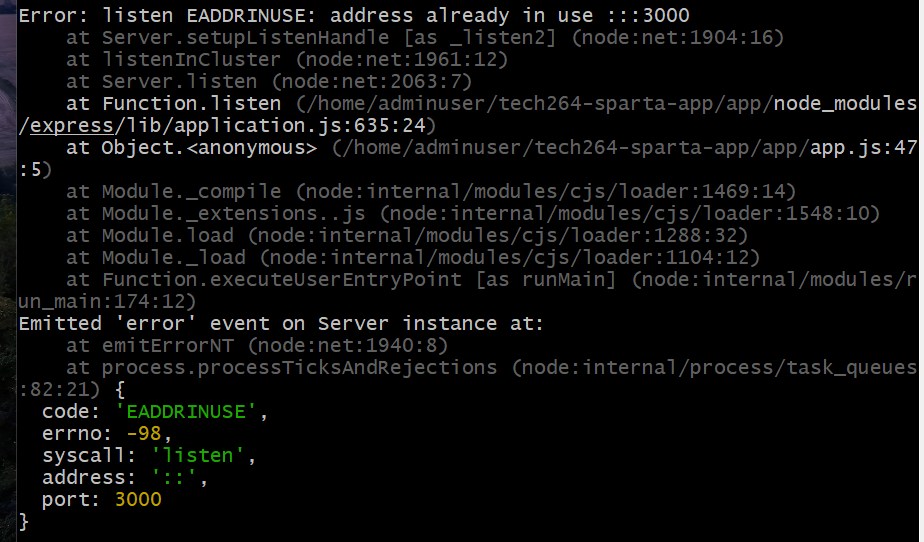

### Explanation of the Error
This error occurs because both instances of the Sparta app are trying to bind to the same port (3000). When the first instance is already running and listening on that port, the second instance cannot start.

### Step 3: Fixing the Error
To resolve this issue, you have two options:

### Option 1: Change the Port Number
1. Open the `server.js` or relevant configuration file of the Sparta app.
2. Change the port number from `3000` to another unused port (e.g., `3001`).
3. Save the changes.
4. Re-run the app in the second terminal using:
   ```bash
   npm start
   ```

### Option 2: Kill the Existing Process Using Port 3000
If you want to run the app on port 3000, you can terminate the process currently using that port.

### Step 4: Finding the Process Using Port 3000
To find out which process is using port 3000, you can use the following command:

### Linux Command:
```bash
lsof -i :3000
```

**Explanation:**
- `lsof` lists open files and the corresponding processes.
- `-i :3000` filters the list to show only processes using port 3000.

### Example Output
You might see output like this:
```
COMMAND   PID USER   FD   TYPE DEVICE SIZE/OFF NODE NAME
node    12345 user   23u  IPv6 0x1234      0t0  TCP *:3000 (LISTEN)
```
In this case, the `PID` (Process ID) is `12345`, which you can use to terminate the process.

### Step 5: Killing the Process
To terminate the process using port 3000, use the `kill` command followed by the PID:

```bash
kill 12345
```

**Note:** If the process does not terminate, you can use `kill -9` to forcefully kill it:
```bash
kill -9 12345
```

## Task: Run Sparta app in the background
 
## Work out ways to both run, stop and re-start the app in the background (besides using the "&" at the end of the command):
 
### One way should use pm2
`pm2` : A production process manager that allows you to run your apps in the background, keep them alive (restart automatically if they crash), monitor performance, and handle logs.
 
`pm2 start npm -- start` : Tells PM2 to start a new process using the npm command to execute the start script defined in your package.json. It launches your Node.js application in the background
 
`pm2 stop npm` :  If you have multiple processes managed by PM2 that were started with the npm -- start, you can stop them all using this command. This effectively halts the application, but does not remove it from PM2's process list.
 
`pm2 restart npm` : This command restarts the running process associated with the npm command. PM2 will first stop the current instance and then start it again, ensuring any updates or changes are applied.
 
Don't forget to install PM2 in your script using `sudo npm install -g pm2`. The `-g` installs this globally, meaning we can access PM2 from any terminal window without needing to be in a specific project directory.

**When using the & operator (e.g., npm start &), the app runs in the background, but there are key issues:**

* No Process Management: There's no built-in way to monitor, restart, or stop the process. You would have to manually kill the process by finding its PID.
* No Restart on Crash: If the app crashes, it won’t automatically restart.
* No Logging: & does not provide logging out of the box, whereas tools like pm2 provide easy access to logs.
 
## Final app and db scripts:
 * [App Script](bash_scripts/prov-app.sh)
 * [DB Script](bash_scripts/prov-db.sh)

### Testing process

It is essential to start the DB script first so that the app has something to connect to, when starting the db script you may need to troubleshoot and look out for some things:
  - SSH into your DB VM and check the status of your mongodb (`sudo systemctl status mongod`).
  - When you create a new app VM make sure you use the private IP that is displayed on your DB VM so that it connects. 
  - `cat /etc/mongod.conf | grep bindIp` to check the bindIp is 0.0.0.0
  - `sudo systemctl is-enabled mongod`

## Images - plan for creating using an app + db image:
1. Create DB VM using custom image and user data to run entire DB script. 
2. Tested user data did it's job. 
3. Create app VM using custom image and user data to run entire app script
   - make sure the DB_HOST variable has the correct IP
4. Test by:
   - check public IP to bring up app homepage 
   - check /posts page
5. Create DB VM image from DB VM
   - delete the DB VM
6. Create DB VM from this image
7. Create app VM image from app VM
   - delete the app VM
8. Create app VM from the app image just created 
   - special script - run-app-only.sh
      - start with the she-bang
      - export DB_HOST env variable
      - cd into app folder
      - (probably don't need it) npm install
      - pm2 stop all
      - pm2 start app.js
   - posts page to work connecting to DB VM made from image

## **To create image:**
1. Select **Capture Image** on the VM of choice's **Overview**.
2. Under **Instance details**, Select **No, capture only a managed image**.
3. Enable **Automatically delete this virtual machine after creating the image**.
4. Name image appropriately.
5. Run `sudo waagent -deprovision+user` inside our DB SSH to remove delete information we no longer need, then return to Azure window.
6. Add tags.
7. Review, then create.

### Possible blockers
* Check DEBIAN_FRONTEND=noninteractive.
* Check on different browser or clear cache on current browser.
* Create separate files to copy the script from. 
* Check to see the order of your script, for example make sure after nginx is installed you configure it. 
* Ensure that if you have started a service that it is enabled too. 

## Alerting and Monitoring

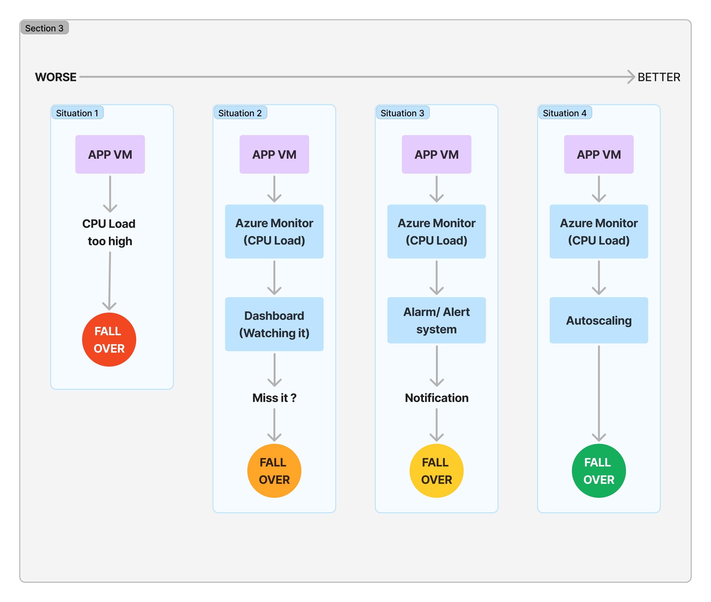
### 1. Manual Monitoring (Worst)
- **Method**: Manually checking the Azure portal to monitor VM scale set metrics (CPU usage, memory usage, etc.).
- **Downside**: Time-consuming, not efficient for handling sudden traffic spikes, and prone to human error.
- **Best For**: Rarely used for critical applications.
   
### 2. Basic Autoscale with Default Thresholds
- **Method**: Setting up basic autoscaling based on default CPU thresholds (e.g., scale out when CPU > 75%).
- **Downside**: Predefined thresholds may not suit every app’s load pattern. Doesn’t account for other metrics like memory or network traffic.
- **Best For**: Non-mission-critical applications with predictable traffic.

### 3. Monitoring with Alerts
- **Method**: Setting up email or SMS alerts to notify the admin when key metrics exceed certain thresholds.
- **Downside**: Still requires manual intervention after receiving alerts.
- **Best For**: Small applications that need real-time notifications for rapid troubleshooting.

### 4. Custom Autoscaling with Advanced Rules
- **Method**: Creating custom autoscaling rules that respond dynamically to changes in traffic, including multiple metrics (CPU, memory, disk I/O).
- **Benefit**: More tailored to application demands, improves resource utilization, handles fluctuating traffic efficiently.
- **Best For**: Applications with unpredictable or varying traffic patterns.

### 5. Continuous Load Testing + Auto-healing with Health Probes (Best)
- **Method**: Combining continuous load testing with health probes and automatic scaling. The load balancer reroutes traffic to healthy instances, while the system automatically heals/recreates unhealthy VMs.
- **Benefit**: Most resilient, handles extreme traffic spikes, and maintains application availability.
- **Best For**: High-availability, mission-critical applications that need 24/7 uptime.


## Types of Scaling 


## Architecture for an Azure VM Scale Set Internet
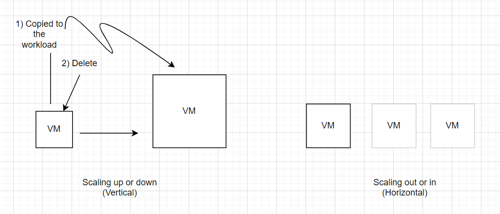

### How to increase CPU
```bash
sudo apt-get install apache2-utils
```
```bash
ab
```
### Dashboard VM
 
1. In the `VM` -> `Overview`-> scroll down to where is:
  * Properties--Monitoring--Capabilities--Recommendations--Tutorials
1. Select `Monitoring`
2. In the monitoring window -> `Platform metrics` -> pin the metrics that we need(e.g. CPU, Disk bytes)
3. `Click pin`-> `create new`-> type(private/pubic) -> `Dashboard name`-> `Pin`
   
### Load testing with Apache Bench and how to create unhealthy instances
 
```bash
ab -n 1000 -c 100 http://yourwebsite.com/
 
# ab -n 1000 -c 100 http://public ip address/
# to increase the requests : ab -n 1000 -c 200...
```
  *You can increase the size of these by increasing the numbers.*

## Scale sets on Azure

### Basics -->
1. Search "scale set" in the top search bar and click **virtual machine scale set**.
2. **Assign** resource group `(tech264)`.
3. **Name** the VM (e.g tech264-name...)
4. Set **region** to `(Europe) UK South`.
5. Select all 3 availability zones.
6. Under **orchestration mode**, select `uniform`.
7. Set the security type to `standard`.
8. For **scaling**, select `autoscaling`. A window will appear below it - click **configure**.
9. Select the pencil for the default condition to edit it.
10. Input **3** for the maximum instances / VMs.
11. Input **75** for the CPU threshold greater than.
12. Select **Save**.
13. Once returned to the basics page, select "see all images".
14. Select "my images" and search for your image - then **select**.
9. Change **username** to something more secure.
10. Change SSH public key source to `Use existing key stored in Azure`.
11. Select **your** Stored key (e.g tech264..).
 
### Disks -->
1. Change OS Disk type to `Standard SSD (locally redundant storage)`.
 
### Networking -->
1. For the **Virtual network**, Select your subnet.
2. Edit your **Network Interface**.
3. Select allow selected ports, then enable `SSH(22)` and `HTTP(80)`.
4. Ensure public IP address is **disabled** as the load balancer will handle this now.
5. Apply those changes and you will be returned to the Networking screen.
6. Select **Create a load balancer**.
7. Change the name to your naming conventions with al "lb" on the end of it, to label it as a **load balancer**.
8. Select **Create**. This will take up the "Select load balancer" slot.
 
### Health -->
1. **Tick** the box labelled "Enable application health monitoring".
2. **Tick** the box labelled "Automatic repairs".
 
### Advanced -->
1. **Tick** the box "Enable user data" to allow an input and insert:
```bash
#!/bin/bash
 
echo "Change directory to app"
cd repo/app
echo "In app directory"
 
# Stop all existing pm2 processes
pm2 stop all
 
echo "start"
pm2 start app.js
echo "App started with pm2
```
 
### Tags -->
1. Select owner and your name.
 
### Review and Create -->
1. **Ensure** you've selected the correct options.
2. **Create** your shiny new VM scale set.

### Delete -->
1. Going to the resource group.
2. Select the NIC, load balancer, public ip and the actual scale set. 
 
### To SSH:
Need to change the private IP with public and at the port which is 5000 (maybe try 5001). 

Should look something like this:

`ssh -i ~/.ssh/tech264-priyan-az-key -p 50000 adminuser@85.210.53.221`

## What is a load balancer?

A Load Balancer is a service that distributes incoming traffic among multiple servers to ensure no single server is overwhelmed, which improves performance and availability. In Azure, the load balancer ensures:

* Even distribution of traffic across VMs.
* Failover protection: If a VM becomes unhealthy or unavailable, the load balancer redirects traffic to healthy VMs.
* Scalability: Easily handles spikes in traffic by balancing across multiple VMs.

### Managing Instances in a Scale Set

- **View Instances**: Go to the **Instances** tab of the Scale Set in Azure Portal. This shows a list of VMs in the scale set.
- **Stop, Start, or Restart Instances**: Use the options to manually stop, restart, or start specific instances.
- **Scaling Instances**: Configure the **scaling rules** in the **Scaling** tab, such as scaling based on CPU usage thresholds.

---

### Create an Unhealthy Instance for Testing

### Steps to Simulate an Unhealthy Instance:

1. **Simulate High CPU Usage**:
   
**How to increase CPU:**
```bash
sudo apt-get install apache2-utils
```

**Load testing with Apache Bench:**
 
```bash
ab -n 1000 -c 100 http://yourwebsite.com/
 
# ab -n 1000 -c 100 http://public ip address/
# to increase the requests : ab -n 1000 -c 200...
```

2. **Check Instance Health**:
   - The health probe configured in the load balancer will check for the responsiveness of the instance.
   - If the instance doesn't respond, it will be marked **unhealthy** and removed from the load balancer’s active pool.

3. **Why It’s Marked Unhealthy**:
   - If an instance fails to respond to health probes (e.g., it’s overloaded or services crash), the load balancer marks it as unhealthy and stops directing traffic to it.

---


## Setting Up a Dashboard in Azure

The Azure Dashboard helps in visualizing key metrics (CPU, memory, network) across all instances in real-time, making it easier to monitor and troubleshoot application health.

### Steps to Setup a Dashboard:

1. **Navigate to Azure Portal**: 
   - Go to the [Azure Portal](https://portal.azure.com).
   
2. **Go to Monitor**: 
   - In the search bar, type **Monitor** and click on the result.
   
3. **Add Metrics to Dashboard**:
   - From the **Monitor** menu, go to **Metrics**.
   - Select your **Resource Group** and **VM Scale Set**.
   - Add key metrics (e.g., **CPU Percentage**, **Network In/Out**, **Disk I/O**).
   - Click **Pin to Dashboard** for each metric.
   
4. **Create Custom Views**:
   - Use the **custom view** option to arrange the dashboard widgets in a way that makes monitoring easier for your specific needs.

5. **Save and Access the Dashboard**:
   - Save the dashboard by giving it a name and selecting "private" or "shared" access.
   - Access the dashboard from the **Dashboard** menu at any time.

---

## How Load Testing and Dashboard Helped Us

By combining **load testing** with **Azure dashboards**, we could visualize how the application behaves under extreme conditions, such as heavy traffic spikes. Here's how this combination helped:

- **Identification of Bottlenecks**: The dashboard revealed high CPU and memory usage under load, showing which instances were struggling to handle traffic.
- **Response to Alerts**: The dashboard showed real-time status, while load testing triggered autoscaling events and CPU alerts, which were instantly reflected on the dashboard.
- **Health Monitoring**: Through load testing, we simulated failures, and the load balancer routed traffic to healthy instances, as visualized in the dashboard.

When pushing the system to extreme loads, I noticed a drop in responsiveness and marked unhealthy instances, as shown on the dashboard. 

---

## CPU Usage Alert Setup

We set up an alert for when CPU usage crosses a threshold to notify us via email.

### Steps to Setup CPU Usage Alert:

1. **Navigate to Monitor**:
   - In the Azure portal, go to **Monitor** > **Alerts**.

2. **Create a New Alert Rule**:
   - Click **Create** > **Alert Rule**.
   - Select your **VM Scale Set** resource.

3. **Define a Condition**:
   - Under **Condition**, choose **CPU Percentage**.
   - Set the alert threshold to, for example, **80%**.
   - Set **Evaluation period** to **1 minute** and **Check frequency** to **every 1 minute**.

4. **Set up Action Group**:
   - In the **Actions** section, create a new action group.
   - Choose **Email/SMS/Push/Voice** for the notification type.
   - Add your email address.

5. **Create Alert**:
   - Give the alert rule a name (e.g., "High CPU Usage Alert").
   - Click **Create**.

6. **Enable Alerts**:
   - Ensure the alert is enabled, and you'll receive notifications when CPU crosses the defined threshold.

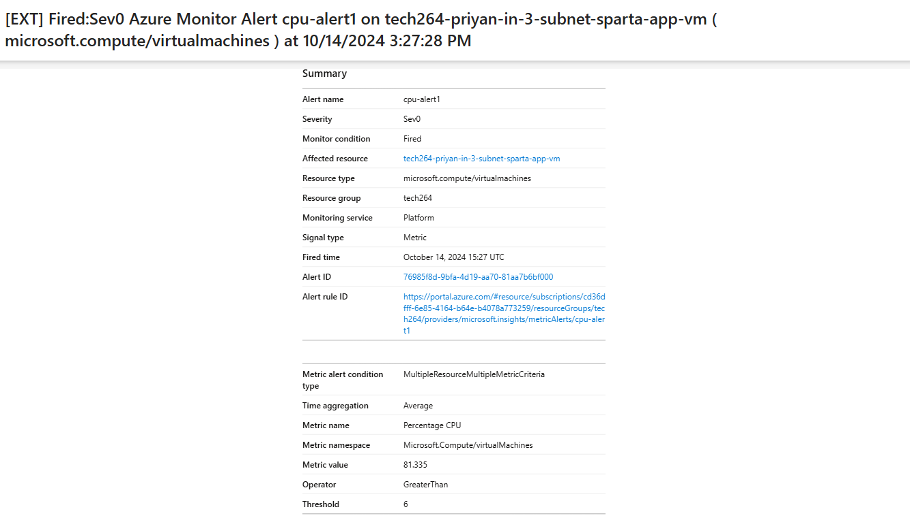

## Remove dashboards and alert and action group

### Removing a Dashboard
1. Navigate to Dashboards:
   * In the Azure portal, click on “Dashboard” from the left-hand menu.
2. Select the Dashboard:
   * Find the dashboard you want to delete. Click on the three dots (ellipsis) next to the dashboard name.
3. Delete the Dashboard:
   * Select “Delete” from the dropdown menu.
   * Confirm the deletion when prompted.
 
### Removing an Alert Rule
1. Navigate to Azure Monitor:
   * In the Azure portal, go to “Monitoring” from the left-hand menu.
2. Select Alerts:
   * Under the “Alerts” section, click on “Alert rules”.
3. Find the Alert Rule:
   * Locate the alert rule you want to delete. You can use the search bar to find it quickly.
4. Delete the Alert Rule:
   * Click on the three dots (ellipsis) next to the alert rule.
   * Select “Delete” and confirm the deletion.
 
### Removing an Action Group
1. Navigate to Azure Monitor:
   * In the Azure portal, go to “Monitoring”.
2. Select Action Groups:
   * Under the “Alerts” section, click on “Action groups”.
3. Find the Action Group:
   * Locate the action group you want to delete.
4. Delete the Action Group:
   * Click on the three dots (ellipsis) next to the action group.
   * Select “Delete” and confirm the deletion.
  

# Re-create the 3-subnet architecture to make the database private


* Public Subnet (10.0.2.0/24):
    * Contains an Application VM (APP VM).
    * An NSG allows inbound HTTP and SSH traffic.
    * Traffic is routed to the DMZ subnet.
* DMZ Subnet (10.0.3.0/24):
    * Acts as an intermediary zone.
    * A Network Virtual Appliance (NVA VM) with IP Forwarding and IP Tables rules is deployed to route and filter traffic.
    * An NSG allows SSH traffic and IP forwarding is enabled to forward traffic to the private subnet.
* Private Subnet (10.0.4.0/24):
    * Contains a Database VM (DB VM).
    * An NSG allows SSH and MongoDB (port 27017) traffic.
    * All other inbound traffic is denied (secured from external threats).
* Route table:
    * Public traffic is routed through the route table to the DMZ subnet, where IP forwarding and security filtering occurs.
    * Traffic is forwarded to the private subnet to communicate with the DB VM while restricting dangerous traffic.


 
## Set up the Virtual Network
 
### --> Basics
1. Name appropriately (tech264-name-in-3-subnet-vnet-db-vm)
 
### --> IP addresses
1. Edit **default subnet**, rename to **public-subnet** and change **starting address** to `10.0.1.0`.
2. Add a new subnet, rename to **dmz-subnet** and change **starting address** to `10.0.3.0`.
3. Add another new subnet for private subnet, rename to private-subnet and change **starting address** to` 10.0.4.0` and enable **private subnet**. This means that whatever you put in this subnet cannot access the internet.
 
### --> Tags
1. Select owner and your name.
 
### --> Review and Create
1. **Ensure** you've selected the correct options.
2. **Create** your shiny new secure virtual network.
 
Then we create a virtual machine using our database image. We start with the database as we follow the 2-tier architecture sructure.
 
## Create Database VM
Follow the usual **DATABASE** steps with these slight changes...
 
### --> Basics
1. Select **zone 3** for avaialiblity zone assigned to the DB.
2. Select the previously created virtual network and select the private subnet. 10.0.4.0
3. Disable public IP address.
4. Only enable **SSH port**.
 
### --> Review and Create
1. **Ensure** you've selected the correct options.
2. **Create** your shiny new DB.
 
Once this is done, we create the application that will connect to the database and display the information.
 
## Create the App VM
Follow the usual **APP** steps with these slight changes...
 
### --> Basics
1. Select **zone 1** for avaialiblity zone assigned to the App.
 
### --> Networking
1. Select public subnet.
 
### --> Advanced
1. Enable **user data** and input your `image script` (script you use to run the image). [run app script](bash_scripts/run-app-only.sh) 
2. Change the **IP** in the **export line** to the **private IP** of the **DB** we created previously.
 
### --> Review and Create
1. **Ensure** you've selected the correct options.
2. **Create** your shiny new App.
 
Now we create the VM for the Network Virtual Appliance (NVA). This performs network functions like routing, firewalling, trafic filtering and load balancing.


 
## Create a virtual machine for the NVA.
 
### --> Basics
1. Name it appropriately (tech264-name-in-3-subnet-nva).
2. Select **zone 2** for avaialiblity zone assigned to the NVA.
3. Select **Standard security** as it may have changed.
4. Select **see all images** and find the **clean-image**.
5. Leave SSH as the only port.
 
### --> Networking
1. Use the **DMZ subnet**.
2. Leave the public IP initially. later on if we used in production, we wouldn't.
 
### --> Review and Create
1. **Ensure** you've selected the correct options.
2. **Create** your shiny new NVA.

### Steps for Code-along (3 subnet architecture)
1. set up a new vnet - 3 subnet version
   1.  create 3 subnets and name then appropriately
   2.  give the addresses 10.0.2.0 for the public, 3 for the dmz and 4 for the private subnet
   3. for the private subnet enable the no outbound access - this mean whatever is in the subnet cannot access the internet
   4. tag yourself as owner
   5. create
2. Create db vm from image
   1. go to your ready-to-run-db image
   2. create a vm
   3. name appropriately 
   4. for availability- self select and db in zone 3
   5. allow ssh (for now)
   6. disk as normal
   7. networking - choose the right vnet and subnet, no public ip
3. Create the app vm from image
   1. go to your ready-to-run-app image
   2. create a vm
   3. name
   4. for availability- self select and db in zone 1
   5. allow http and ssh
   6. disk as normal
   7. networking - choose the right vnet (3 subnet vnet) and subnet (public)
4. Create NVA vm
   1. create with ramons's clean image image
   2. name
   3. for availability- self select and db in zone 2
   4. allow just ssh
   5. disk as usual
   6. networking - choose the right vnet (3 subnet vnet) and subnet (dmz)
   7. give public ip (for now) to allow us to ssh in
   8. no user data - can upgrade and update when we ssh in
   9. create
5. Set a ping (sends a packet regularly) to check the comms between the app and the db vms
   1. ssh into the app vm
   2. we want to ping the db vm ```ping 10.0.4.4```
   3. each message is the db replying and it also tells you how long the response takes (ctrl c/z to exit)
Note: To get the page + /posts page running at this stage before you make your route table:
SSH into your app VM and run the following: 
   ``` bash
   export DB_HOST="mongodb://10.0.4.4:27017/posts"
   cd /repo/app
   sudo -E pm2 start app.js
   ```
6. set up routing (using a routing table)
Routes under Settings
   1. Click **Routes**.
   2. Click **Add**.
   3. For the **route name**, input `to-private-subnet-route`.
   4. For the **destination type**, select **IP addresses**.
   5. For **Destination IP addresses/CIDR ranges**, we use the private subnet: `10.0.4.0/24`.
   6. For the next **hop type**, select **Virtual appliance**.
   7. For the next **hop address** input the **IP** of the NVA: `10.0.3.4`.
   8. Select **Add**.
 
Now we need to associate the route table to where the traffic comes out of.
 
Subnet under Settings
   1. Click **Associate**.
   2. Choose your virtual network.
   3. Select the **public-subnet**.
7. enable ip forwarding on the NVA NIC
   1. go to the network settings on the VM
   2. tick the box that says enable ip forwarding 
   3. SSH into the NVA VM and carry out the follwing commands (we need to make sure we update and upgrade): `sysctl net.ipv4.ip_forward` - this checks if it is on
   `sudo nano /etc/sysctl.conf` - edit this configuration file and uncomment the line with net.ipv4.ip_forward
   `sudo sysctl -p` - this reloads the configuration command
   The ping should keep outputting and the posts page should be working now. 
8. need to add the ip-table script in the NVA VM
   1. [config-ip-table.sh](bash_scripts/config-ip-table.sh): use this script by using `nano`
In the script: 
`-A` : Stands for "Append." It adds a new rule to the end of a specified chain (e.g., INPUT, OUTPUT, FORWARD).
 
`-i` : Stands for "Input interface." It specifies the network interface for incoming traffic.
 
`-o` : Stands for "Output interface." It specifies the network interface for outgoing traffic.
 
`-p` : Stands for "Protocol." It specifies the protocol used (e.g., TCP, UDP, ICMP).
 
`--dport` : Stands for "Destination port." It specifies the port number for incoming traffic.
 
`--sport` : Stands for "Source port." It specifies the port number for outgoing traffic.
 
`-m` : Stands for "Match." It specifies a module that provides additional matching criteria (e.g., state, conntrack).
 
`--state` : Used with the -m state module to specify the state of the connection (e.g., NEW, ESTABLISHED, RELATED, INVALID).
 
`-j` : Stands for "Jump." It specifies the target action to take when a rule matches (e.g., ACCEPT, DROP, REJECT).
   
   2. change the permissions of the file by `chmod +x config-ip-table.sh`
   3. Run the script `./config-ip-table.sh`
---  
9. Set Network Security Group Rules
    1. Navigate to your **DB virtual machine**.
    2.  Go to **Network Settings** under **Networking**.
    3.  Click the `tech264-priyan-in-3-subnet-vnet-vm-nsg` link next to **Network security group**.
    4.  Go to **inbound port rules** and click **Add**.
    5.  Under **Source**, select **IP addresses**.
    6.  Under **Source IP addresses/CIDR ranges**, input the **public subnet IP** `10.0.2.0/24`.
    7.  Change the service to MongoDB.
    8.  Change the name appropriately.
10. Create a rule to deny everything else
    1. **Add** another rule.
    2.  Input a `*` to the **destination port ranges**.
    3.  Change the priority to `500`.

## How to make a Database private using a 3 Subnet Architecture

* You have the following screenshots to visualise how to make it safer:
  * Creating the VNet in the first place to ensure that you have an intemediary to route the traffic safely. 
  * Making sure you delete the public ip for the DB.
  * Creating the inbound rules as in the screenshot below.

Screenshots:
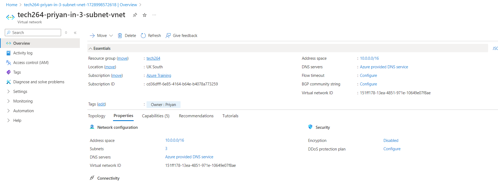

<br>

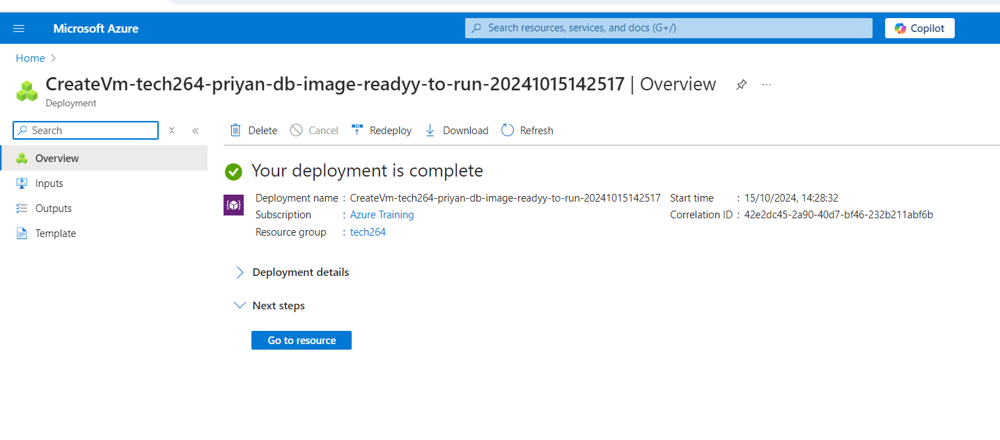

<br>

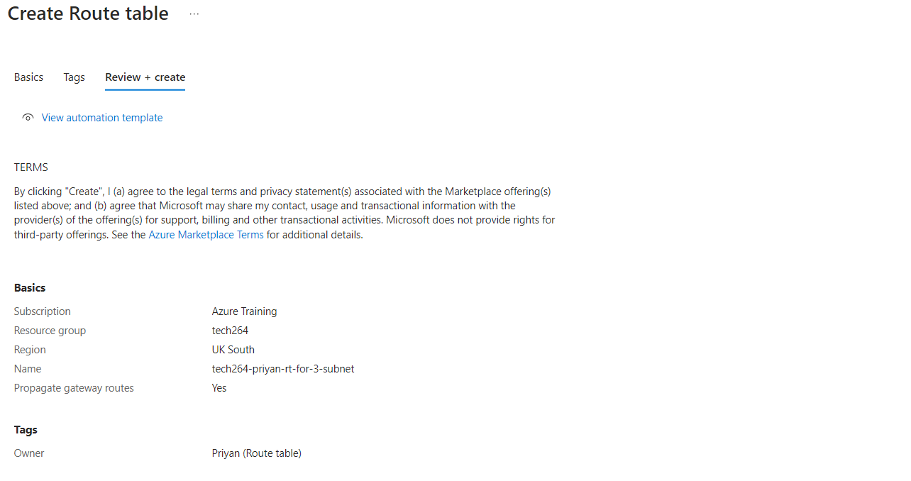

<br>

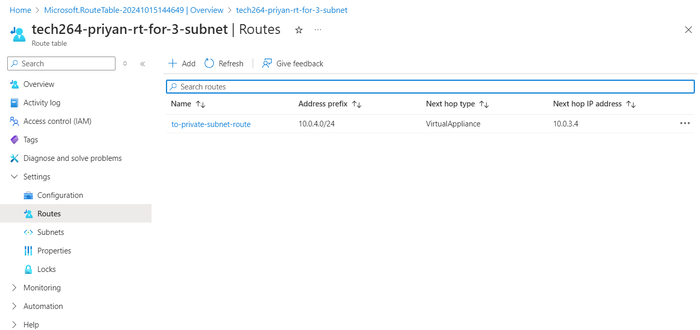

<br>

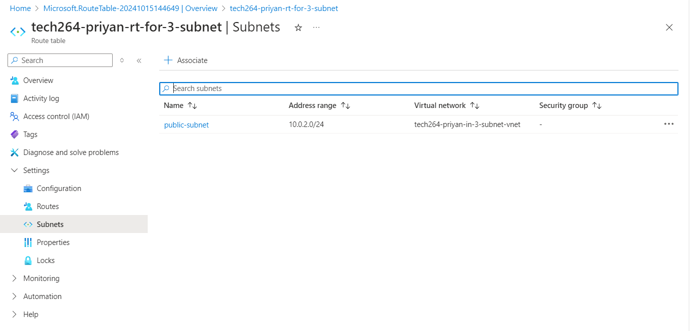

<br>

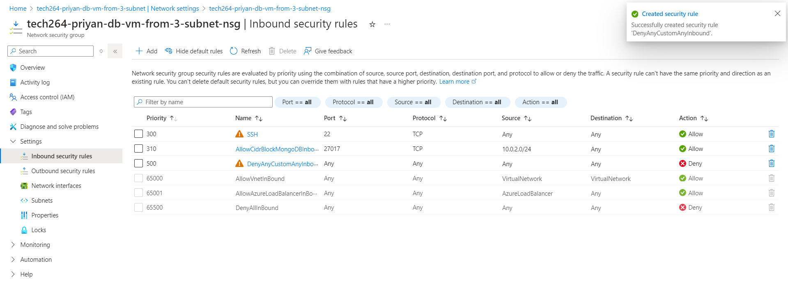


### Stopping all the VMs and Restarting
* When you start all three VMs again:
  1) SSH into your app VM and export the environment variable. 
  2) Then you can check if this is set with `printenv DB_HOST`. 
  3) Run the command `sudo -E pm2 start app.js`: The -E basically reminds the system to check the the env variable we have created and use it when starting. 
  4) Now search the public ip address with the `/posts` and it should work. 
* **It is important to note** that it needs to be in this order if you do forget the step you can stop the process with `pm2 stop all` and restart. Or restart the VMs and SSH back in. 